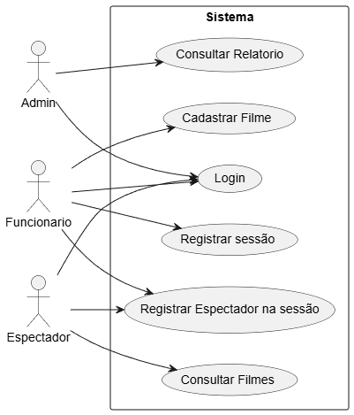
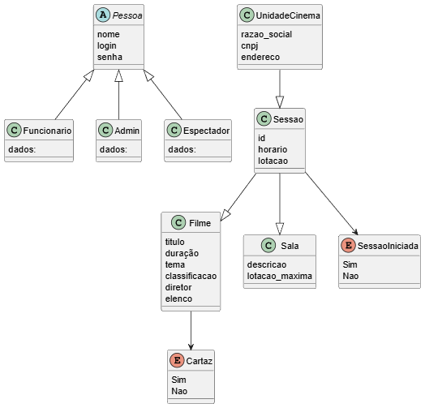
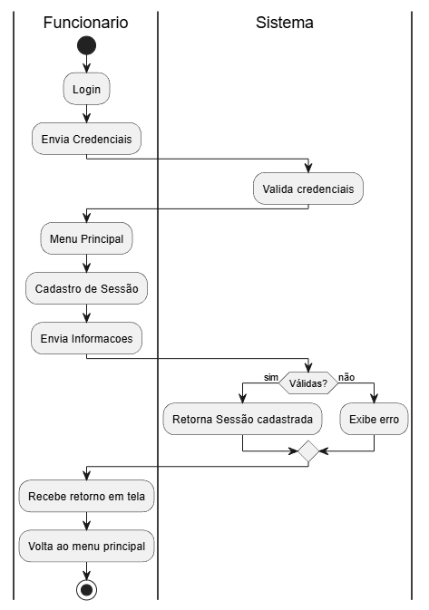
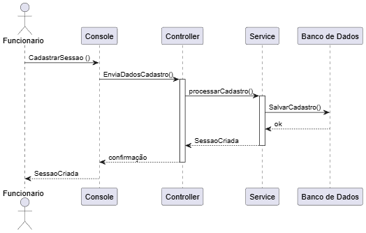

## Requisitos Funcionais

RF01 - Manter Cadastro de Unidades: O sistema deve permitir o cadastro, edição e exclusão de unidades de cinema, contendo endereço completo e capacidade total de público.

RF02 - Gerenciar Catálogo de Filmes: O sistema deve permitir o registro de filmes com informações de título, duração, gênero, elenco e diretor.

RF03 - Programar Sessões: O sistema deve permitir o agendamento de sessões de filmes, vinculando um filme a uma sala/cinema em um horário específico.

RF04 - Registrar Público: O sistema deve permitir a inserção do número de espectadores presentes em cada sessão realizada.

RF05 - Consultar Acervo: O sistema deve oferecer uma ferramenta de busca para localizar filmes por elenco, diretores ou gêneros.

RF06 - Gerar Relatórios de Público: O sistema deve emitir relatórios de totalização de público, permitindo filtros por sessão, por filme e por unidade de cinema.

RF07 - Listar Grade de Programação: O sistema deve exibir a lista de filmes em cartaz e seus respectivos horários por unidade selecionada.

## Regras de negócio

RN01 - Intervalo entre Sessões: O sistema deve impedir o agendamento de uma nova sessão na mesma sala sem um intervalo mínimo obrigatório de 30 minutos após o término do filme anterior.

RN02 - Capacidade Máxima: O registro de público de uma sessão não pode exceder a capacidade física total definida para a unidade/sala de cinema.

RN03 - Sobreposição de Horários: Não deve ser permitida a alocação de dois filmes simultâneos em uma mesma sala de cinema.

RN04 - Vigência de Exibição: Um filme só pode ser vinculado a uma sessão se estiver com o status "Em Cartaz".

RN05 - Integridade de Dados de Sessão: Uma sessão só pode ser finalizada e ter seu público registrado após o horário de início previsto.

RN06 - Obrigatoriedade de Classificação: Todo filme cadastrado deve obrigatoriamente possuir pelo menos um gênero e um diretor associado.

RN07 - Unicidade de Cadastro: Não deve ser permitido o cadastro de duas unidades de cinema com o mesmo endereço completo.

## Diagrama casos de uso:

## Diagrama classe dominio:

## Diagrama de Atividade:

## Diagramas de sequência

